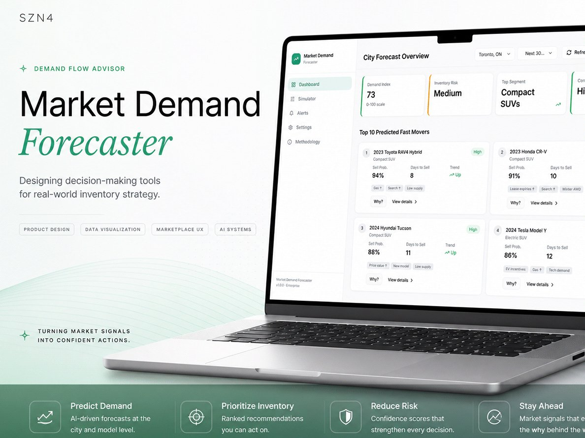

# Market Demand Forecaster (Demand Flow Advisor)

**An inventory-planning dashboard for car dealers that turns market signals into ranked next actions and explains the reasoning behind every prediction.**

[**Live prototype**](https://demand-flow-advisor.vercel.app/) · [**Case study**](https://www.szn4.design/market-demand-forecaster/)



> **Tip:** in the prototype, go to **Settings** and switch on **Portfolio Mode**. Each screen then shows overlays explaining the design decisions behind it.

## The problem

Dealers aren't short of data. Inventory decisions are still reactive, spread across disconnected tools and made on instinct. This isn't a data problem. It's a decision problem.

## What it does

- **City Forecast Overview:** demand index, inventory risk, top segment and forecast confidence at a glance
- **Top predicted fast movers:** sell probability, days to sell, trend and the signals driving each one
- **"Why?" panel:** ranked contributing factors with weights, plus an "In simple terms" summary
- **Recommended inventory moves,** colour-coded by priority with estimated impact
- **Scenario Simulator** and **Live Alerts**
- **Methodology page** describing the signals used
- **Portfolio Mode** case study overlays, built into the product itself

## Built with

React 18 · TypeScript · Vite · Tailwind CSS · shadcn/ui (Radix) · Recharts · React Router

Built with AI-assisted development (Lovable) and deployed on Vercel.

## Run it locally

Requires Node.js 18 or newer.

```bash
npm install
npm run dev
```

Then open the local URL Vite prints (usually http://localhost:8080). The login screen accepts any email and password.

| Script | What it does |
|---|---|
| `npm run dev` | Start the dev server |
| `npm run build` | Production build to `dist/` |
| `npm run preview` | Preview the production build |
| `npm run lint` | Lint the project |

## Project structure

```
src/
  pages/        Login, Dashboard, VehicleDetail, ScenarioSimulator,
                LiveAlerts, Methodology, Settings
  components/   dashboard/, layout/, portfolio/ (Portfolio Mode overlays)
  components/ui shadcn/ui primitives
```

## Notes

Concept study and portfolio piece. Forecasts, probabilities and market signals are **mock data** that demonstrate the experience.

---

Designed and built by **Sabrina Mohammed** · [szn4.design](https://www.szn4.design/) · [LinkedIn](https://www.linkedin.com/in/sabrina-mohammed-31694483/)
